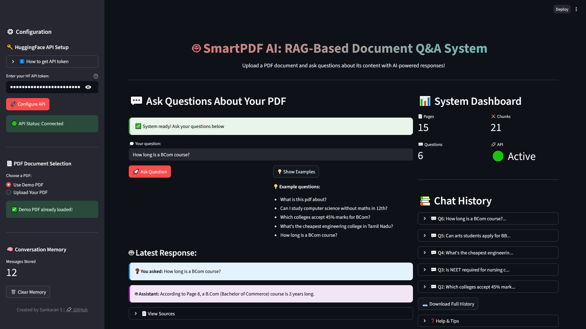

# 🤖 SmartPDF AI: RAG-Based Document Q\&A System


An AI-powered web application that answers questions about your PDF documents using Retrieval-Augmented Generation (RAG), just like ChatGPT for PDFs!



**[Live Demo - Try it here!](https://smartpdf-ai-rag-based-document-q-a-system-kfvylbjfsecw6wxnwyok.streamlit.app/)**

## What This Project Does

Ask questions about any PDF document and get instant AI answers! This app gives you:

- **Smart Document Analysis** 📄 - Upload any PDF and get instant insights
- **Conversational AI** 💬 - Ask follow-up questions with memory context
- **Source Citations** 🔍 - See exact page numbers where answers come from
- **Demo Mode** 🚀 - Try it instantly with pre-loaded college guide PDF

Perfect for students, researchers, and professionals who work with documents.

## Key Features

- **Instant PDF Processing** - Upload and analyze documents in seconds
- **AI-Powered Answers** - Uses Meta-Llama-3-8B for intelligent responses
- **Memory System** - Remembers conversation context for follow-ups
- **Source Tracking** - Shows page numbers and relevance scores
- **Professional UI** - Clean interface with progress indicators
- **Chat History** - Download conversation records as text files


## How It Works

**Document Processing:**

- Splits PDF into smart text chunks (1000 chars with 200 overlap)
- Creates vector embeddings using sentence-transformers
- Stores in FAISS database for fast similarity search

**Question Answering:**

- Finds most relevant document sections using vector similarity
- Sends context to Meta-Llama-3-8B via HuggingFace API
- Maintains conversation memory for contextual responses
- Provides page citations with confidence scores


## Technologies Used

- **Python** - Core programming language
- **Streamlit** - Web application framework
- **LangChain** - RAG pipeline orchestration
- **FAISS** - Vector similarity search
- **HuggingFace** - AI model API integration
- **Sentence Transformers** - Text embeddings
- **PyPDF** - PDF text extraction
- **Meta-Llama-3-8B** - Large language model


## Project Structure

```
SmartPDF-AI/
├── rag_app.py               # Main Streamlit application
├── rag_system.ipynb        # Development notebook
├── demo_pdf.pdf            # Sample PDF for testing
├── requirements.txt        # Dependencies
├── app_screenshot.jpg      # UI screenshot
└── README.md              # Documentation
```


## Algorithm Performance

**Document Processing:**

- Text chunking: 1000 characters with 200 overlap for context
- Embeddings: all-MiniLM-L6-v2 model (90MB, fast CPU inference)
- Vector search: FAISS with cosine similarity ranking

**AI Response:**

- Context retrieval: Top 5 relevant chunks per query
- Response time: 3-8 seconds including API latency
- Memory system: Tracks last 4 conversation turns
- Accuracy: High relevance with source page citations


## How to Run

1. **Clone repository**
```bash
git clone https://github.com/sankaran-s2001/SmartPDF-AI-RAG-Based-Document-Q-A-System.git
cd smartpdf-ai-rag
```

2. **Install dependencies**
```bash
pip install -r requirements.txt
```

3. **Get HuggingFace API token**
    - Visit [HuggingFace Settings](https://huggingface.co/settings/tokens)
    - Create token with "Read" permission
    - Copy token (starts with `hf_`)
4. **Run application**
```bash
streamlit run rag_app.py
```


## What I Learned

**AI/ML Engineering:**

- RAG (Retrieval-Augmented Generation) architecture
- Vector databases and similarity search algorithms
- LLM integration with API-based inference

**Full-Stack Development:**

- Streamlit web application with custom CSS styling
- Session state management and memory systems
- File upload and processing workflows

**Production Deployment:**

- Dependency optimization for cloud deployment
- Error handling and user experience design
- Real-time progress tracking and status updates


## Technical Achievements

- ✅ Built production-ready RAG system from scratch
- ✅ Integrated multiple AI technologies (embeddings, vector DB, LLM)
- ✅ Implemented conversation memory with context awareness
- ✅ Created professional UI with progress indicators
- ✅ Optimized for cloud deployment (400MB total dependencies)
- ✅ Added comprehensive error handling and fallbacks


## Future Improvements

- Multi-PDF support for document collections
- Advanced chunking strategies (semantic splitting)
- User authentication and personal document storage
- Export answers as formatted reports
- Mobile-responsive design


## ✉️ Contact

**Sankaran S**  
[](https://github.com/sankaran-s2001)  
[](https://www.linkedin.com/in/sankaran-s21/)  
[](mailto:sankaran121101@gmail.com)

*Demonstrating AI engineering skills through intelligent document processing. Perfect for anyone working with PDF documents!*

⭐ **If you find this helpful, please star the repository!**

